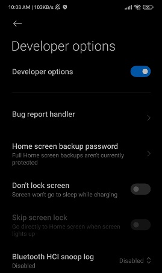
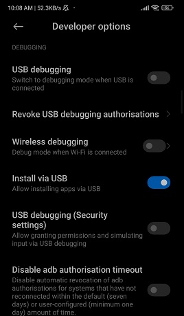
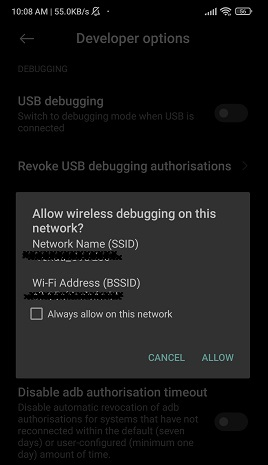
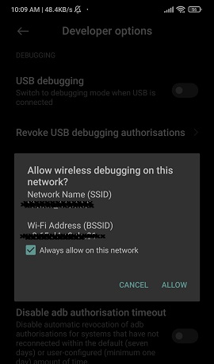
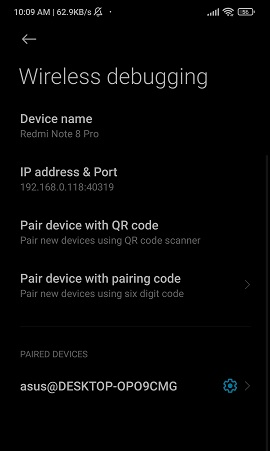

# Android Setup

# wifi setup

- enter the following code
- `adb connect [IP]:[PORT]` // check this value in setting>Dev>enable wireless debugging> ip address & port
- `adb connect [IP]:[PORT]` //Port can be identified from settings>Developer mode>enable wireless debugging>[IP]:[PORT]
- `adb devices` // Show devices
- `adb disconnect [IP]:[PORT]` //To disconnect Wi-Fi devices

### other ways

- For initial via usb and then wifi
- `adb tcpip 5555`
- now disconnect usb
- `adb connect [IP]:[PORT]`
- adb install further extension for other things adb interface in vs code

